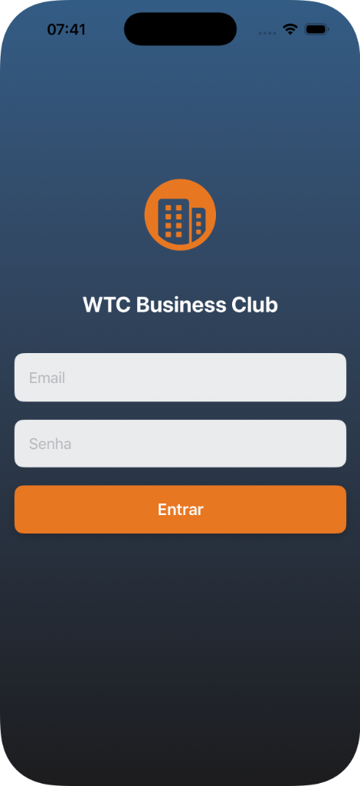
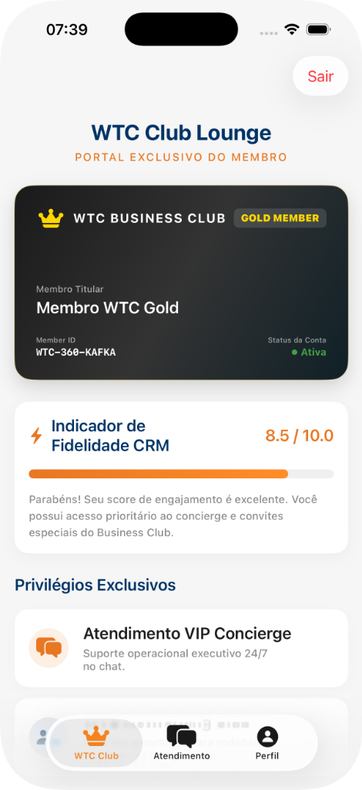
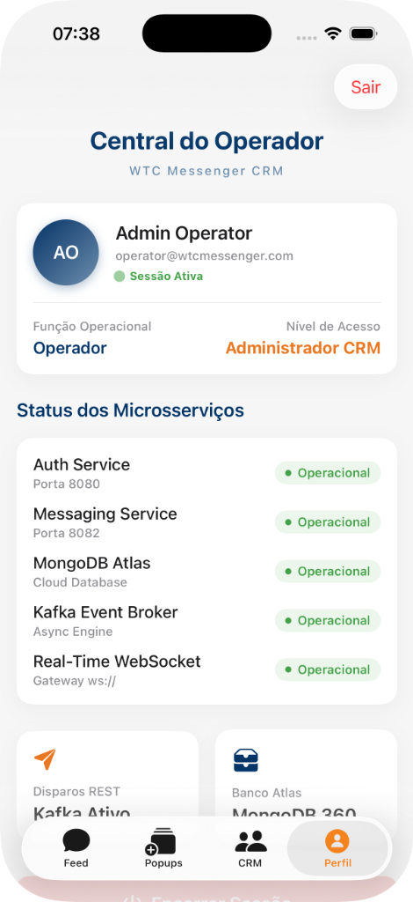

# WTCMessenger - Aplicativo CRM e Mensageria (SwiftUI) 📱✨

O **WTCMessenger** é um aplicativo móvel desenvolvido nativamente em **SwiftUI** para iOS. Ele integra-se diretamente com os microsserviços do ecossistema backend WTC (Autenticação e Mensageria) e oferece uma experiência de chat fluida, reativa e inteligente, alinhada com as melhores práticas de design moderno da Apple.

O app é o frontend oficial para a resolução do **Enterprise Challenge FIAP & BRQ Digital Solutions**.

---

## 📸 Demonstração Visual das Telas Reais

Para ilustrar o acabamento visual premium e as interfaces implementadas, veja as capturas de tela reais do aplicativo rodando no simulador iOS:

| 🔐 1. Tela de Login | 👑 2. Portal do Cliente VIP | 💼 3. Painel do Operador |
| :---: | :---: | :---: |
|  |  |  |

---

## 🌟 Funcionalidades e Telas Principais

O aplicativo opera de forma dinâmica, fornecendo duas interfaces completas com base no perfil do usuário logado:

### 💼 1. Painel do Operador de Relacionamento (`operador`)

- **Feed de Conversas (Feed Tab)**: Lista ativa de conversas carregada em tempo real direto do MongoDB.
- **Chat em Tempo Real (`ChatView`)**:
  - **Conexão WebSockets**: Atualização instantânea de mensagens sem necessidade de recarregar a tela, sincronizado com o broker Apache Kafka do backend.
  - **Diferencial de Usabilidade — Comandos Rápidos "/"**: Atalhos inteligentes no teclado que geram mensagens pré-definidas instantaneamente para o cliente:
    - `/promo` 📢: Dispara template de oferta de 20% de desconto na anuidade Gold.
    - `/boleto` 📄: Envia de forma rápida a linha digitável e informações de faturamento.
    - `/agradecer` 🙏: Envia mensagem formal de agradecimento e parceria institucional.
  - **Barra de Rolagem Automática**: Foca e rola de forma reativa a cada nova mensagem enviada ou recebida.
- **Megaphone (Marketing Tab — `AnnouncementSendView`)**:
  - **Copiloto de IA WTC (Gemini)**: O operador escreve um briefing informal de marketing (ex: _"criar convite para evento de networking de tecnologia nesta sexta"_). O app aciona a API do Gemini via Spring AI e preenche de forma automática Título, Mensagem de Texto, Banner Ilustrativo e gera **Ações Interativas (Deep Links)** representadas por botões de RSVP.
  - **Disparo via Kafka**: Dispara o anúncio rico com múltiplos links e imagens em massa para um segmento específico de clientes.
- **CRM de Clientes**:
  - **Anotações CRM**: Permite salvar anotações rápidas por cliente, com suporte a inserção e remoção imediata.
  - **Busca de Usuários**: Filtro rápido para pesquisa de contatos da carteira.

### 👑 2. Portal VIP do Cliente (`cliente / CUSTOMER`)

- **WTC Club Lounge**:
  - **Cartão Virtual Gold Member**: Renderizado com gradiente metálico escuro com bordas douradas, exibindo nome do membro titular, ID de autenticação e status.
  - **Indicador de Engajamento CRM**: Gráfico visual reativo (custom progress bar) demonstrando o score de fidelidade do cliente (ex: 8.5/10.0).
  - **Privilégios Exclusivos**: Lista estilizada de benefícios como atendimento Concierge 24/7 e reservas de salas VIP.
- **Atendimento Concierge**: Canal direto de suporte via chat com resposta simulada automática para validação de fluxos.

---

## 🏗️ Estrutura do Código-Fonte

- **`WTCMessengerApp.swift`**: Arquivo de inicialização e controle das rotas baseadas no estado de login.
- **`Core/`**:
  - `DesignSystem.swift`: Define cores corporativas (`wtcPrimaryBlue`, `wtcHighlightOrange`, `wtcSuccessGreen`, `wtcLightGray`) e estilos de fontes centralizados.
  - `WTCMessengerIntegration.swift`: Concentra o `NetworkManager` (requisições REST com token JWT, cadastro de clientes, consumo de timeline 360° e geração da IA) e o `WebSocketManager` (escuta persistente de WebSockets).
- **`Models/`**:
  - `LoginViewModel.swift` e `AnnoucementModel.swift`: Modelagem dos dados decodificáveis do JSON do backend.
- **`Views/`**:
  - `Auth/`: Telas de login e perfil de operador.
  - `Main/`: As visões centrais (`MainView.swift`), envio de campanhas (`AnnouncementSendView.swift`), timeline unificada do cliente (`CustomerTimelineView.swift`) e popups de notificação in-app (`DemoPopupView.swift`).

---

## 🚀 Como Executar o Aplicativo

### 📋 Pré-requisitos

1.  **Xcode 14+** instalado no macOS.
2.  **Simulador de iOS** ou dispositivo físico conectado.
3.  **Backend rodando** (`docker compose up --build -d` no repositório do backend) [Link do Repositório do Backend](https://github.com/rb-belarmino/WTCMessenger-Backend).

### ⚙️ Ajuste de Rede para Dispositivo Físico / Simulador

Por padrão, o app iOS tenta se conectar ao backend rodando em `localhost`.

- Se você estiver rodando no **Simulador do Xcode**, a comunicação funciona automaticamente usando `localhost`.
- Se for compilar em um **iPhone Físico**, os microsserviços devem ser acessados via rede local. Para isso:
  1. Descubra o IP local da sua máquina (ex: `192.168.1.50`).
  2. Abra o arquivo `Core/WTCMessengerIntegration.swift` no seu projeto.
  3. Altere a variável `host` em ambos `NetworkManager` e `WebSocketManager` para o IP da sua máquina:

  ```swift
  // Em NetworkManager (linha ~325)
  private let host = "192.168.1.50" // Suba o IP local do seu Mac

  // Em WebSocketManager (linha ~574)
  private let host = "192.168.1.50" // Suba o IP local do seu Mac
  ```

### 🎬 Execução

1. Abra o arquivo `WTCMessenger.xcodeproj` no Xcode.
2. Selecione o simulador alvo (ex: _iPhone 15_).
3. Aperte o botão **Play / Run** (ou o atalho `⌘ + R`).

---

## 🎨 Design System & Estilo Visual

O app segue à risca o manual de usabilidade diferenciada:

- **Tipografia Modernizada**: Usa fontes e tamanhos customizados para títulos, capturas e descrições, evitando fontes brutas padrão do sistema.
- **Feedback Visual Reativo**: Botões desabilitam dinamicamente se campos obrigatórios estiverem vazios e spinners de carregamento (`ProgressView`) são mostrados durantes transações de rede.
- **Notificações Pop-up**: Notificações ricas in-app integradas aos banners promocionais para emular a experiência de atendimento corporativo moderno.

---

**Desenvolvido como Frontend do Desafio WTC - FIAP**  
_Garante integração real e consumo completo dos microsserviços Spring Boot do ecossistema backend._
